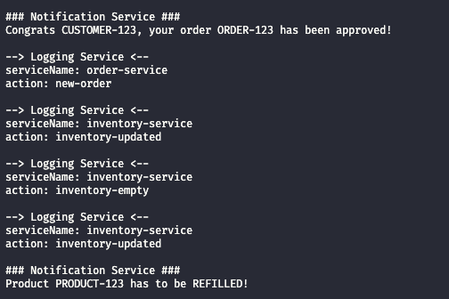
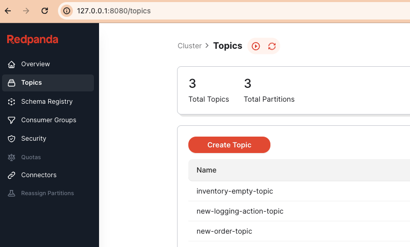

# What is Kafka in a nutshell?

Kafka is a distributed streaming platform that is designed to handle real-time data feeds with high throughput and fault tolerance. It consists of servers and clients that communicate via a high-performance TCP network protocol. It can be deployed on bare-metal hardware, virtual machines, and containers in on-premise as well as cloud environments.

And to make it work properly you need, at least, to understand these four definitions:

- **Topic**: think of a topic as a category or a channel where messages are organized and published. It's like a virtual inbox or bulletin board where messages related to a specific theme or subject are posted.
- **Event**: a piece of data or a message that represents a specific action or occurrence, that will be sent to a topic.
- **Producer**: is like a sender or a publisher that generates and sends events to topics.
- **Consumer**: is like a receiver or a subscriber that reads and processes events from topics. It's responsible for fetching and handling messages from the topics it subscribes to.

# How does it work?

Let's imagine we have an e-commerce and we have a distributed system, as follows:

- **Order Service**: responsible for listing products and checkout process
- **Inventory Service**: responsible for updating product quantity
- **Notification Service**: responsible for sending notifications
- **Logging Service**: responsible for tracking everything that happens in the services

For this scenario, we will define topics, producers, consumers, and events contract, as follows:

#### Topics

- **new-order-topic**: receive events related to new orders
- **inventory-empty-topic**: receive events related to inventory product quantity
- **new-logging-action-topic**: receive events related to new actions from other services

#### Consumers

- **Inventory Service**: consumes events from **new-order-topic**
- **Notification Service**: consumes events from **new-order-topic**, and **inventory-empty-topic**
- **Logging Service**: consumes events from **new-logging-action-topic**

#### Producers

- **Order Service**: produces events to be sent to **new-order-topic** and **new-logging-action-topic**
- **Inventory Service**: produces events to be sent to **inventory-empty-topic** and **new-logging-action-topic**
- **Notification Service**: produces events to be sent to **new-logging-action-topic**

#### Events Contract per Topic

- **new-order-topic**:

```Typescript
{
  orderId: string,
  customerId: string,
  products: [
    {
      productId: string,
      quantity: number,
      totalPrice: number
    }
  ]
}
```

```JSON
// Sample
{
  "orderId": "ORDER-123",
  "customerId": "CUSTOMER-123",
  "products": [
    {
      "productId": "PRODUCT-123",
      "quantity": 3,
      "totalPrice": 80
    },
    {
      "productId": "PRODUCT-321",
      "quantity": 1,
      "totalPrice": 233
    }
  ]
}
```

- **inventory-empty-topic**:

```Typescript
{
  productId: string,
}
```

```JSON
// Sample
{
  "productId": "PRODUCT-123"
}
```

- **new-logging-action-topic**:

```Typescript
{
  serviceName: string,
  action: string,
}
```

```JSON
// Sample
{
  "serviceName": "order-service",
  "action": "new-order",
}
```

That's is it, we have all in place to start the hands-on!

# Hands-on

### Prerequisites

To follow this guide, you need these two requirements:

- Node.js 18+: If you have not Node.js installed on your machine, [download the installer from the official site](https://nodejs.org/en/download), launch it, and follow the wizard.
- Docker: [Follow the installation guide for your operating system](https://docs.docker.com/get-docker/) to set up Docker on your computer.

The following sub-chapters show only the main steps to start using Kafka into Node.js. To avoid getting lost, we recommend keeping the codebase of the final application at hand by cloning the GitHub repository that supports this article:

```
git clone https://github.com/manganellidev/dev-to-hands-on-kafka.git
```

### Set Up Your Kafka Project

Create a folder for your Node.js application, enter it, and run the npm init command below to bootstrap a new npm project:

```
npm init -y
```

Install kafkajs to your project’s dependencies:

```
npm install kafkajs
```

Copy the `docker-compose.yml` from the Github repository to your root folder.

Create `src/` folder and an `index.js` file inside, then create a lib, db, and services as sub folders. After that, you shall create one module for each service, a module for the kafka client, and a module for the database in memory, below is what your project's directory should contain:

```
├── node_modules/
├── src/
│    └── db
│      └── inventory.js
│    └── lib
│      └── kafka-client.js
│    └── services
│      └── order-service.js
│      └── inventory-service.js
│      └── notification-service.js
│      └── logging-service.js
│      └── kafka-client.js
│    └── index.js
├── docker-compose.yml
├── package-lock.json
├── package.json
└── README.md
```

In `package.json`:

- Add the `type` config to enable ES Modules:

```
"type": "module"
```

- Add the `start` script in the scripts object to make it easier to run your application:

```
"start": "node index.js"
```

### Index

It will import all services that will be listening/consuming the topics and publishing new events as well. Also, it will run forever creating a new order event every 5 seconds, to simulate an e-commerce scenario.

```Javascript
import "./services/inventory-service.js";
import "./services/logging-service.js";
import "./services/notification-service.js";
import createNewOrder from "./services/order-service.js";

const orderOne = {
  orderId: "ORDER-123",
  customerId: "CUSTOMER-123",
  products: [
    {
      productId: "PRODUCT-123",
      quantity: 3,
      totalPrice: 80,
    },
    {
      productId: "PRODUCT-321",
      quantity: 1,
      totalPrice: 233,
    },
  ],
};

(async () => {
  await createNewOrder(orderOne);

  // call createNewOrder recursively every 5 seconds
  setInterval(() => createNewOrder(orderOne), 5000);
})();
```

### Kafka Client Module

Configure the Kafka client adding the following config:

```Javascript
import { Kafka } from "kafkajs";

const CLIENT_ID = "kafka-hands-on";
// this URL must point to your local Kafka that is configured in docker-compose.yml
const BROKERS_URL = ["localhost:29092"];

export const TOPIC_NEW_ORDER = "new-order-topic";
export const TOPIC_INVENTORY_EMPTY = "inventory-empty-topic";
export const TOPIC_NEW_LOGGING_ACTION = "new-logging-action-topic";

const kafkaClient = new Kafka({ clientId: CLIENT_ID, brokers: BROKERS_URL });

export default kafkaClient;

```

### Services Module

#### Order Service

This service has a single function that will be responsible for triggering the whole messaging process. In other words, it will create a new order event and the consumers will receive this event and start doing other processes in an async fashion.

```Javascript
import kafkaClient, {
  TOPIC_NEW_ORDER,
  TOPIC_NEW_LOGGING_ACTION,
} from "../lib/kafka-client.js";

const producer = kafkaClient.producer();

const createNewOrder = async (input) => {
  try {
    await producer.connect();

    // create a new event for new-order-topic
    await producer.send({
      topic: TOPIC_NEW_ORDER,
      messages: [{ value: JSON.stringify(input) }],
    });

    // create a new event for new-logging-action-topic
    await producer.send({
      topic: TOPIC_NEW_LOGGING_ACTION,
      messages: [
        {
          value: JSON.stringify({
            serviceName: "order-service",
            action: "new-order",
          }),
        },
      ],
    });
  } catch (err) {
    console.error(err);
  } finally {
    await producer.disconnect();
  }
};

export default createNewOrder;
```

#### Inventory Service

This service has a IIFE that will be listening the `new-order-topic` for new events all the time. The other services have a similar implementation.

```Javascript
import kafkaClient, {
  TOPIC_NEW_ORDER,
  TOPIC_INVENTORY_EMPTY,
  TOPIC_NEW_LOGGING_ACTION,
} from "../lib/kafka-client.js";
import productInventory from "../db/inventory.js";

// the groupId must be unique. In case you have multiple instances of the inventory-service running it will ensure only one of them process that event. Which means, in case one of the instances is down it will automatically distribute to other instance of the group.
const consumer = kafkaClient.consumer({ groupId: "inventory-service-group" });
const producer = kafkaClient.producer();

const sendEventToNotifyProductInventoryIsEmpty = async (productId) => {
  // create a new event for inventory-empty-topic
  await producer.send({
    topic: TOPIC_INVENTORY_EMPTY,
    messages: [{ value: JSON.stringify({ productId }) }],
  });
  // create a new event for new-logging-action-topic
  await producer.send({
    topic: TOPIC_NEW_LOGGING_ACTION,
    messages: [
      {
        value: JSON.stringify({
          serviceName: "inventory-service",
          action: "inventory-empty",
        }),
      },
    ],
  });
};

const processAndValidateProductsInventory = async (products) => {
  for (const product of products) {
    const prodQuantity = productInventory.product(product.productId);
    const updatedProdQuantity = prodQuantity - product.quantity;

    // update product inventory
    productInventory.setProduct(product.productId, updatedProdQuantity);

    await producer.send({
      // create a new event for new-logging-action-topic
      topic: TOPIC_NEW_LOGGING_ACTION,
      messages: [
        {
          value: JSON.stringify({
            serviceName: "inventory-service",
            action: "inventory-updated",
          }),
        },
      ],
    });

    // validates if the inventory is below 100 items for each product
    if (updatedProdQuantity <= 100) {
      // notify that the product needs to be refilled and log action
      await sendEventToNotifyProductInventoryIsEmpty(product.productId);

      // refill product inventory
      productInventory.setProduct(product.productId, 109);
    }
  }
};

// Function Expression Immediately Invoked (IIFE): once this module is imported it will be listening/waiting for new events on new-order-topic forever
(async () => {
  await producer.connect();
  await consumer.connect();
  await consumer.subscribe({
    topics: [TOPIC_NEW_ORDER],
    // get all events from the beginning
    fromBeginning: true,
  });

  await consumer.run({
    eachMessage: async ({ message }) => {
      // destructure message value to get only the products from it
      const { products } = JSON.parse(message.value);

      await processAndValidateProductsInventory(products);
    },
  });
})();
```

#### Logging Service

```Javascript
import kafkaClient, { TOPIC_NEW_LOGGING_ACTION } from "../lib/kafka-client.js";

const consumer = kafkaClient.consumer({ groupId: "logging-service-group" });

(async () => {
  await consumer.connect();
  await consumer.subscribe({
    topics: [TOPIC_NEW_LOGGING_ACTION],
    fromBeginning: true,
  });

  await consumer.run({
    eachMessage: async ({ message }) => {
      const { serviceName, action } = JSON.parse(message.value);

      console.log(
        `\n--> Logging Service <--\nserviceName: ${serviceName}\naction: ${action}`
      );
    },
  });
})();
```

#### Notification Service

```Javascript
import kafkaClient, {
  TOPIC_NEW_ORDER,
  TOPIC_INVENTORY_EMPTY,
} from "../lib/kafka-client.js";

const consumer = kafkaClient.consumer({
  groupId: "notification-service-group",
});

// an object of functions by topics to be called whenever an event arrives from that specific topic
const funcByTopic = {
  [TOPIC_INVENTORY_EMPTY]: ({ productId }) =>
    console.log(
      `\n### Notification Service ###\nProduct ${productId} has to be REFILLED!`
    ),
  [TOPIC_NEW_ORDER]: ({ orderId, customerId }) =>
    console.log(
      `\n### Notification Service ###\nCongrats ${customerId}, your order ${orderId} has been approved!`
    ),
};

(async () => {
  await consumer.connect();
  await consumer.subscribe({
    // here this module is listening to two topics
    topics: [TOPIC_NEW_ORDER, TOPIC_INVENTORY_EMPTY],
    fromBeginning: true,
  });

  await consumer.run({
    eachMessage: async ({ topic, message }) => {
      // dynamic call specific function by incoming event topic
      funcByTopic[topic](JSON.parse(message.value));
    },
  });
})();
```

### DB Module

It contains a single module with a class to store the products quantity.

```Javascript
class ProductInventory {
  #products;

  constructor() {
    this.#products = new Map();
    this.#products.set("PRODUCT-123", 109);
    this.#products.set("PRODUCT-321", 109);
  }

  product(id) {
    return this.#products.get(id);
  }

  setProduct(id, value) {
    this.#products.set(id, value);
  }
}

// export directly the instance to make it a singleton
export default new ProductInventory();
```

### Running the application

Open a second terminal and start the kafka broker using the command:

```
docker-compose up
```

Now, with the containers up and running you should be able to access the Redpanda UI that is an admin panel for the Kafka broker in the URL: http://127.0.0.1:8080


After that you can start the application using the start script in the primary terminal:

```
npm start
```

In the terminal you will notice that some logs, related to the Logging Service, as image below:


And in the Redpanda UI you will notice in the Topics menu your topics are created and populated with the events, as image below:



P.S you can change the object `orderOne` present in the `index.js` to check for different behaviors. Also, you can change the quantity in the `db.js`.

<br/>
<hr/>
<br/>

That's it folks! Thanks for reading. Happy coding 🎉🎉🎉
